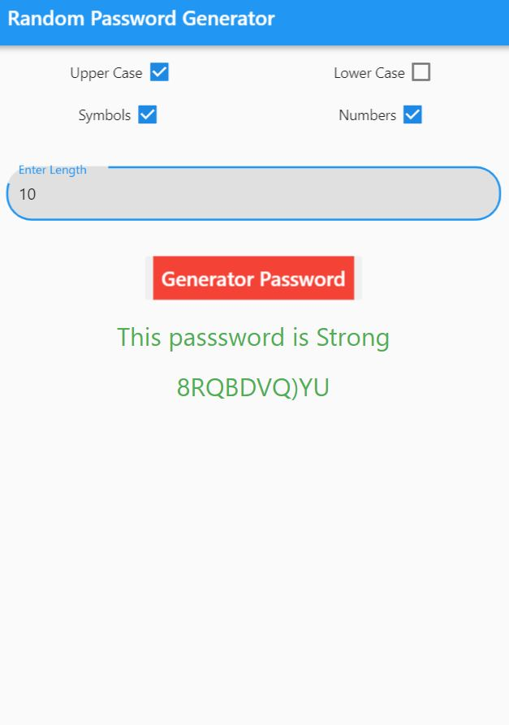
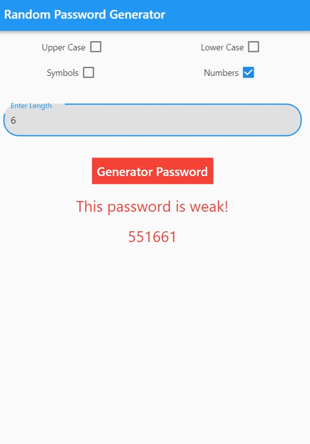
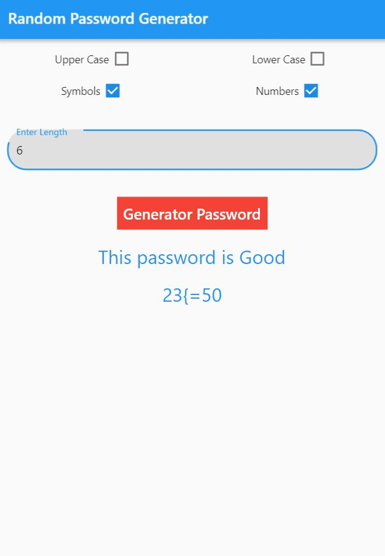

# random_password_generator

A new Flutter package for android and iOS also web which help generate strong password for online accounts and password strength estimator for Dart.

## Usage

```dart

import 'package:random_password_generator/random_password_generator.dart';

...

final password = RandomPasswordGenerator();

String newPassword = password.random_password(true, false, true, false, 6);

double passwordstrength = password.check_password('hello');

if (passwordstrength < 0.3) 
    print('This password is weak!');
else if (passwordstrength < 0.7)
    print('This password is Good');
else
    print('This passsword is Strong');


```

  

## Getting Started

This project is a starting point for a Dart
[package](https://flutter.dev/developing-packages/),
a library module containing code that can be shared easily across
multiple Flutter or Dart projects.

For help getting started with Flutter, view our 
[online documentation](https://flutter.dev/docs), which offers tutorials, 
samples, guidance on mobile development, and a full API reference.
